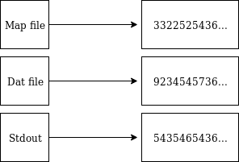
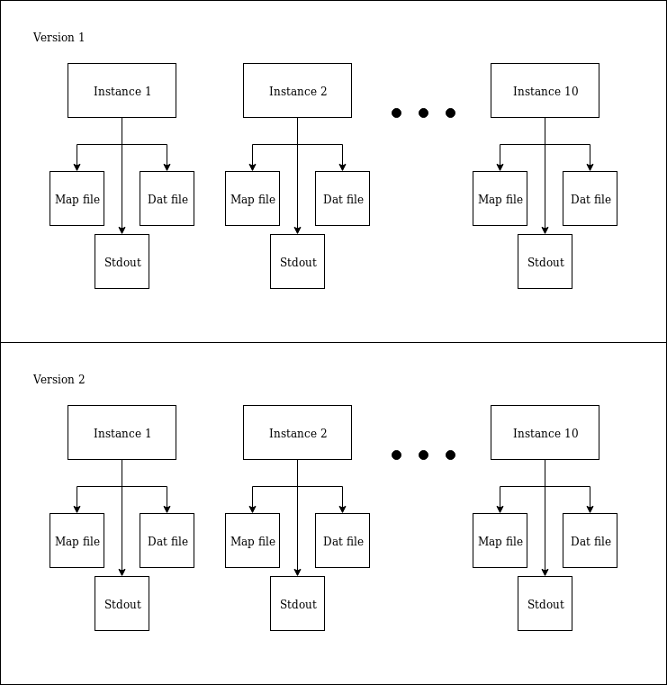

##### Programming Skills 2019 - Semester 1
##### Student Exam Number: B159973
##### University of Edinburgh @ 2019- 2020
# Percolate 
## Assignment Introduction

The program solves the following problem. Suppose we have a grid of squares which some are filled with a numbers and the rest are invalid. Using the uniform distribution, which is a distribution that has constant probability we can always output the same map. This is done by feeding the same seed in the constant probability. The probability function outputs a result that is checked with an input density.  After that a map is initialized based on the given seed. The program performs a loop which replaces each square with the maximum four neighbors and checks if the bottom row has a the same number with the top row. If this happens, then the program percolates, which means there is a line of available squares. The map is then written to a .dat file and later to a .pgm file via a special conversion. 


Assignment pdf file can be found here [here](ext/ProgrammingSkillsCoursework.pdf).

## Dependencies
#### GCC Compiler
The program needs gcc compiler in order to compile. Please install the gcc compiler [GNU](https://gcc.gnu.org/).
The following version can run the program. 
```sh
$ gcc -v
 gcc version 4.8.5(GCC) 
```
#### Doxygen:
Generating a documentation in other format rather than plain text might come handy. The project includes a doxygen configuration file. Install & Download [Doxygen](http://www.doxygen.org/download.html) if you like a good documentation in html files. Find the  `index.html` and open it with a modern browser:
```sh
$ doxygen configDoxygen
$ cd doc
$ cd html
$ ls -a | grep index.html 
```

## Install

#### Makefile:
Make is a powerful tool. The program is builded  completely via make. First it compiles the`*.c` files found in `/src` folder and then moves the object files under the `/obj` folder. After than it links the files together and produces the binary executable  in `/bin` folder under the name `percolate.exe`. 
There are several commands that makefile can take. All the commands must run inside the **project root directory** where the `Makefile `is located.
To **build** the program run the following:
```sh
$ make all
```
To **clean** the  `*.o` object files and the executable under `/obj` and the executable along with its output, issue:
```sh
$ make clean
```
To **print**  variables of the makefile issue:
```sh
$ make print
```
**Help** menu of makefile:
```sh
$ make help
```
## Run

#### Run executable
After the make command, the program can run via `run.sh` which is located in`\bin`folder:
```sh
$ cd bin
$ chmod +x  run.sh
$ chmod +rw perc.conf
$ ./run.sh
```
The run file first takes the values from the configuration file `perc.conf`  which is located in`\bin`folder. Please insert the values in the file first and then run `run.sh` .If no values are found then the run file uses default values: 
```sh
size_l= 50
rho= 0.5
seed= 1000 
max_clusters= 50
pgm_file= out.pgm
dat_file= out.dat
```

#### Manually
To run the program do the following:
```sh
$cd bin 
$ ./percolate  -l [grid size]  -s [seed]  -r [rho]  -m [max clusters]  -d [filename.dat] -p [filename.pgm] 
```

##### Parameters:

It is very **important** to enter the parameters in the corect form. The program will not run if it detect parameters with wrong formats or exceeding lenghts:

1.  **Grid Size** : Must be an positive integer, up to `9` digits. Allocation of a huge map may crush the system.

2. **Seed**: Must be an integer between `0` and `900,000,000`

3. **Rho**: Must be a valid fraction between` 0` and `1` with one dot. (ex: 0.5) and up to 9 digits.

4. **Max Clusters**:  Must be an positive integer, not exceeding (grid size * grid size).

5. **DAT filename**: A valid filename without these characters `%^!~|@*><`. It must also end with `.dat` 

6. **PGM filename**: A valid filename without these characters` %^!~|@*><`. It must also end with `.pgm` 

## Outputs
The program outputs a .**dat file** and **.pgm file** inside the `\bin`folder. The **pgm file** is an image of the clusters and you can see the percolation.

To display the **pgm file** run: 
```sh
$display  filename.pgm
```
To see the contents of **dat file** run
```sh
$cat filename.dat
```

## Regression Test

Regression Test was implemented using regression tests package of Python (  )
It is crucial to mention that for this particular test, we assume that Version 1 of the program, was the original one that was handed by the examiner.
Moreover, we assume that the new refactored version is the one that was given back to the examiner. 
We do not assume that Version 2 perseveres **functional correctness** and therefore its output must be compared for equality with Version 1. 
The particular regression test does not compare its output by itself countless times on only one version but instead uses both versions. 
Furthermore, the test is built in a way where it could be used for testing **future versions** because essential functions in the library of regression test 
can collect output via a configuration input file as the refactored version uses.

### Choice of Test
Test cases are properly selected and are focus on quality rathen than quantity. **Extreme** and **average test cases** are included:

|				| Instance 1 	| Instance 2   	|  Instance 3  |  Instance 4 |  Instance 5 |
| ------------- | ------------- | ------------- | ------------ | ----------- | ----------- |
|Size L:		| 20			|1				|100           |200          |100    
|RHO   			| 0.40			|0.1			|0.5           |1            |0.0
|Seed  			| 1564  		|1				|10000000      |1000         |10
|Max Clusters:  | 400  			|1				|10            |100          |1

|				| Instance 6 	| Instance 7   	|  Instance 8  |  Instance 9 |  Instance 10 |
| ------------- | ------------- | ------------- | ------------ | ----------- | ----------- |
|Size L:		| 1000			|500			|200           |250          |2    
|RHO   			| 0.50			|0.55			|0.3           |0.90         |0.1
|Seed  			| 5       		|555			|112           |3333         |9999999
|Max Clusters:  | 100  			|5				|10            |100          |1

Extreme cases are composed of relatively small or huge grid size, low or high RHO, any parameter that is close to the boundary is checked.
Average cases include cases like instance 1 which was the initial parameters as the program was handed to students.
The following extreme case was successful, but it took about 10-15 minutes to complete, and therefore it is not included in the 
current test case for the convenience of the examiner to run the tests instantly:

|				| Instance 11 	|
| ------------- | ------------- |
|Size L:		| 10000			|    
|RHO   			| 0.9999		|
|Seed  			| 9999999       |
|Max Clusters:  | 100  			|


#### Composition of the Regression Test

The testing structure has three components: 

1. The python unit test `test_regression.py` which is found in `\test` folder
2. A helper library, `regression.py` which peforms compilation and execution of the above instances, along with output gathering. It is located under `\lib` folder.
3. A batch script, `regression.sh` that calls the unit test with the helper library. It is located in the `root` directory.
4. The above test cases are found in `test` folder under the same instance name in Version 1 & 2. 

#### Run the Regression Test

Perform these commands to run the regression test in the `root` directory. The test takes on average about 30 seconds to complete because each instance must run.

```sh
$ chmod +x regression.sh
./regression.sh
```
#### Regression test mechanism
The current regression test, takes the output below from each instance: 
1. A pgm file 
2. A dat file
3. Screen output

An overall example can be shown here: 



After that it filters them, so that only the numbers that are contained within them are collected: 



Finally it asserts them as two different variables using assertEqual(a, b) which checks that a == b ( [unittest](https://docs.python.org/3/library/unittest.html) ).

#### Report

The regression test generates a report that is under `test` with the name `report.xml`. The report shows that
the regression test is successful at the first line and prints the standard output of the executions of each instance. 
